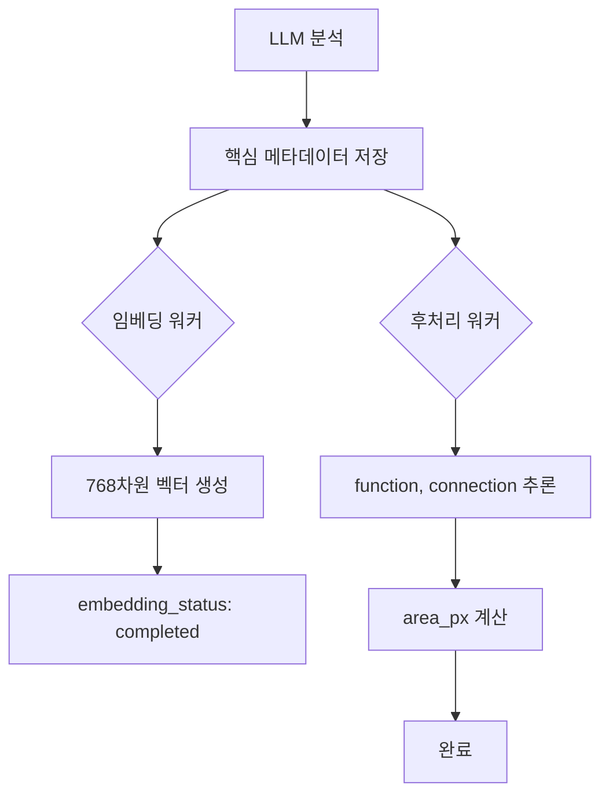

# 🤖 BrickBox 워커 시스템

## 📋 개요

BrickBox는 2개의 백그라운드 워커로 메타데이터를 자동 생성합니다.

---

## 🔄 워커 종류

| 워커 | 역할 | 언어 | 속도 | 리소스 |
|------|------|------|------|--------|
| **임베딩 워커** | CLIP 벡터 생성 (768차원) | Python | 느림 (~10개/초) | GPU 권장, 1GB |
| **후처리 워커** | 계산 필드 채우기 | JavaScript | 빠름 (~100개/초) | CPU만, 256MB |

---

## 1️⃣ 임베딩 워커

### 역할:
- `feature_text` → CLIP 텍스트 임베딩 (768차원)
- `clip_text_emb`, `semantic_vector` 필드 생성
- 유사도 검색을 위한 벡터 생성

### 실행:
```bash
# Python 의존성 설치
pip install openai-clip torch supabase python-dotenv

# 워커 실행
python scripts/embedding_worker.py
# 또는
npm run worker
```

### 처리 흐름:
```
parts_master_features (embedding_status = 'pending')
  ↓
CLIP 모델 (ViT-L/14)
  ↓
768차원 벡터 생성
  ↓
clip_text_emb, semantic_vector 업데이트
  ↓
embedding_status = 'completed'
```

### 상세 가이드:
📚 **[deployment/WORKER_DEPLOYMENT_GUIDE.md](../deployment/WORKER_DEPLOYMENT_GUIDE.md)**

---

## 2️⃣ 후처리 워커 (NEW!)

### 역할:
- `function` 추론 (building_block, mechanical, connector 등)
- `connection` 추론 (stud_connection, hinge_connection 등)
- `area_px` 계산 (bbox_ratio 기반)
- `shape` 추론 (curved, angular, rounded 등)

### 실행:
```bash
# Node.js 의존성 설치 (이미 설치됨)
npm install

# 워커 실행
node scripts/postprocess_worker.js
# 또는
npm run worker:postprocess
```

### 처리 흐름:
```
parts_master_features (function = 'unknown' OR connection = 'unknown')
  ↓
규칙 기반 매핑 (shape_tag → function, connection)
  ↓
feature_json 업데이트
  ↓
완료
```

### 매핑 예시:
```javascript
shape_tag: 'brick'      → function: 'building_block', connection: 'stud_connection'
shape_tag: 'gear'       → function: 'mechanical',     connection: 'axle_connection'
shape_tag: 'hinge'      → function: 'connector',      connection: 'hinge_connection'
shape_tag: 'animal_figure' → function: 'decoration', connection: 'integrated'
```

### 상세 가이드:
📚 **[deployment/POSTPROCESS_WORKER_GUIDE.md](../deployment/POSTPROCESS_WORKER_GUIDE.md)**

---

## 🚀 빠른 시작

### 개발 환경 (로컬)

#### 옵션 1: 자동 실행 (기본) ⭐ 추천
```bash
npm run dev
```
- Vite (프론트엔드)
- 임베딩 워커 (Python)
- 후처리 워커 (JavaScript)

**모두 자동으로 시작됩니다!**

#### 옵션 2: 워커 없이 실행
```bash
npm run dev:no-worker
```

#### 옵션 3: 개별 워커 실행
```bash
# 터미널 1: 프론트엔드
npm run dev:no-worker

# 터미널 2: 임베딩 워커
npm run worker

# 터미널 3: 후처리 워커
npm run worker:postprocess
```

---

### 프로덕션 환경

#### PM2 배포 (추천)
```bash
# 모든 워커 시작
pm2 start deployment/ecosystem.config.js

# 상태 확인
pm2 status

# 개별 워커 제어
pm2 restart embedding-worker
pm2 restart postprocess-worker
```

#### Systemd 배포
```bash
# 임베딩 워커
sudo systemctl start embedding-worker

# 후처리 워커
sudo systemctl start postprocess-worker

# 상태 확인
sudo systemctl status embedding-worker
sudo systemctl status postprocess-worker
```

---

## 📊 처리 파이프라인

### 전체 흐름:



### 필드별 처리:

| 필드 | 생성자 | 타이밍 |
|------|--------|--------|
| `shape_tag`, `stud_count` 등 | LLM | 즉시 |
| `clip_text_emb`, `semantic_vector` | 임베딩 워커 | 10초 이내 |
| `function`, `connection` | 후처리 워커 | 30초 이내 |

---

## 🔍 모니터링

### 워커 상태 확인

```bash
# PM2
pm2 status
pm2 logs embedding-worker --lines 50
pm2 logs postprocess-worker --lines 50

# Systemd
sudo systemctl status embedding-worker
sudo systemctl status postprocess-worker
sudo journalctl -u embedding-worker -f
sudo journalctl -u postprocess-worker -f
```

### DB 상태 확인

```sql
-- 임베딩 대기 중
SELECT COUNT(*) FROM parts_master_features WHERE embedding_status = 'pending';

-- 후처리 대기 중
SELECT COUNT(*) FROM parts_master_features 
WHERE (feature_json->>'function' = 'unknown' OR feature_json->>'connection' = 'unknown');

-- 전체 완료율
SELECT 
  COUNT(*) FILTER (WHERE embedding_status = 'completed') * 100.0 / COUNT(*) AS embedding_rate,
  COUNT(*) FILTER (WHERE feature_json->>'function' != 'unknown') * 100.0 / COUNT(*) AS postprocess_rate
FROM parts_master_features;
```

---

## ⚙️ 설정

### 환경 변수 (.env)

```bash
# Supabase
VITE_SUPABASE_URL=https://your-project.supabase.co
VITE_SUPABASE_ANON_KEY=your-anon-key

# 임베딩 워커 (Python)
SUPABASE_URL=https://your-project.supabase.co
SUPABASE_KEY=your-service-role-key

# 후처리 워커 (JavaScript)
VITE_SUPABASE_URL=https://your-project.supabase.co
VITE_SUPABASE_ANON_KEY=your-anon-key
```

### 성능 튜닝

#### 임베딩 워커 (`scripts/embedding_worker.py`)
```python
BATCH_SIZE = 10        # 배치 크기
POLL_INTERVAL = 10     # 폴링 주기 (초)
DEVICE = "cuda"        # GPU 사용
```

#### 후처리 워커 (`scripts/postprocess_worker.js`)
```javascript
const BATCH_SIZE = 50         // 배치 크기
const POLL_INTERVAL = 30000   // 폴링 주기 (ms)
```

---

## 🐛 트러블슈팅

### 임베딩 워커

**문제**: GPU 메모리 부족
```bash
# CPU 모드로 전환
DEVICE="cpu" python scripts/embedding_worker.py
```

**문제**: CLIP 모델 다운로드 실패
```bash
# 수동 다운로드
python -c "import clip; clip.load('ViT-L/14')"
```

### 후처리 워커

**문제**: 환경 변수 없음
```bash
# .env 파일 확인
cat .env | grep SUPABASE

# 수동 설정
export VITE_SUPABASE_URL="https://..."
export VITE_SUPABASE_ANON_KEY="..."
node scripts/postprocess_worker.js
```

---

## 📈 성능 비교

| 항목 | 임베딩 워커 | 후처리 워커 |
|------|-------------|-------------|
| **처리 속도** | ~10개/초 | ~100개/초 |
| **메모리** | 1GB (GPU) | 256MB |
| **CPU 사용** | 낮음 (GPU 사용) | 낮음 (5-10%) |
| **폴링 주기** | 10초 | 30초 |

---

## ✅ 검증

### 임베딩 워커 확인:
```sql
SELECT 
  part_id,
  embedding_status,
  LENGTH(clip_text_emb) > 0 AS has_embedding
FROM parts_master_features
WHERE embedding_status = 'completed'
LIMIT 5;
```

### 후처리 워커 확인:
```sql
SELECT 
  part_id,
  shape_tag,
  feature_json->>'function' AS function,
  feature_json->>'connection' AS connection,
  area_px
FROM parts_master_features
WHERE feature_json->>'function' != 'unknown'
LIMIT 5;
```

---

## 🎯 요약

### 임베딩 워커 ✅
- ✅ 딥러닝 기반 (CLIP)
- ✅ GPU 활용
- ✅ 768차원 벡터 생성
- ✅ 유사도 검색 핵심

### 후처리 워커 ✅
- ✅ 규칙 기반 (빠름)
- ✅ CPU만 사용
- ✅ 메타데이터 완성
- ✅ 필터링/분석 편의성

**두 워커는 독립적으로 작동하며, 둘 다 실행하면 메타데이터가 100% 완성됩니다!** 🎉

