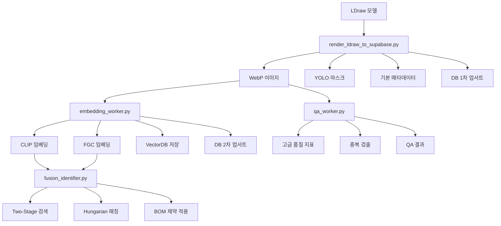

# BrickBox 파이프라인 역할 분리 설계서 v1.0

## 📋 개요

BrickBox 시스템의 파이프라인을 **역할별로 분리**하여 각 스크립트가 명확한 책임을 가지도록 설계했습니다.

## 🎯 설계 원칙

### 1. **단일 책임 원칙 (SRP)**
- 각 스크립트는 하나의 명확한 역할만 담당
- 의존성 최소화 및 테스트 용이성 확보

### 2. **비동기 파이프라인 설계**
- 렌더링과 AI 처리가 병렬로 진행
- GPU/CPU 사용률 극대화

### 3. **버전 관리 및 롤백 용이성**
- 각 단계별 버전 관리
- 실패 시 이전 단계로 롤백 가능

## 🏗️ 파이프라인 구조

### **1단계: 렌더링 및 기본 처리**
```
render_ldraw_to_supabase.py
├── WebP 렌더링 (Blender + LDraw)
├── YOLO 세그멘테이션 (기본)
├── 기본 품질 지표 (SSIM/pHash)
├── 기본 AI 메타데이터 (12필드 중 8개)
└── DB 1차 업서트 (version=1)
```

### **2단계: AI 임베딩 처리**
```
embedding_worker.py
├── CLIP 임베딩 생성
├── FGC 임베딩 생성
├── 벡터 외부 저장 (VectorDB)
└── DB 2차 업서트 (version=2)
```

### **3단계: 식별 및 매칭**
```
fusion_identifier.py
├── Two-Stage FAISS 검색
├── Fusion 알고리즘
├── Hungarian 매칭
└── BOM 제약 조건 적용
```

### **4단계: 품질 검증**
```
qa_worker.py
├── 고급 품질 지표 계산
├── 중복 이미지 검출
├── 깊이/가림 검증
└── QA 결과 저장
```

## 📊 역할 분리 상세

### **render_ldraw_to_supabase.py** (렌더링 엔진)
**책임**: 렌더링 + 기본 QA + 초기 메타 + DB 기록

| 기능 | 포함 여부 | 이유 |
|------|-----------|------|
| WebP 렌더링 | ✅ 필수 | 파이프라인 진입점 |
| YOLO 세그멘테이션 | ✅ 기본 | 탐지용 마스크 생성 |
| 기본 품질 지표 | ✅ 필수 | 중복/불량 이미지 방지 |
| 기본 AI 메타 | ✅ 필수 | 12필드 중 8개 자동 생성 |
| DB 1차 업서트 | ✅ 필수 | 초기 메타 저장 |
| CLIP/FGC 임베딩 | ❌ 제거 | 별도 워커로 이동 |
| Fusion 매칭 | ❌ 제거 | 별도 워커로 이동 |
| 고급 QA | ❌ 제거 | 별도 워커로 이동 |

### **embedding_worker.py** (임베딩 워커)
**책임**: AI 임베딩 생성 및 관리

| 기능 | 포함 여부 | 이유 |
|------|-----------|------|
| CLIP 임베딩 생성 | ✅ 필수 | 이미지-텍스트 매칭 |
| FGC 임베딩 생성 | ✅ 필수 | 세밀한 분류 |
| 벡터 외부 저장 | ✅ 필수 | 대용량 벡터 관리 |
| FAISS 인덱스 구축 | ✅ 필수 | 빠른 검색 |
| DB 2차 업서트 | ✅ 필수 | 임베딩 해시 저장 |

### **fusion_identifier.py** (식별 워커)
**책임**: 탐지-식별 매칭 및 BOM 제약

| 기능 | 포함 여부 | 이유 |
|------|-----------|------|
| Two-Stage FAISS | ✅ 필수 | CLIP + FGC 결합 |
| Fusion 알고리즘 | ✅ 필수 | 다중 모델 융합 |
| Hungarian 매칭 | ✅ 필수 | 최적 매칭 |
| BOM 제약 조건 | ✅ 필수 | 폐쇄 환경 보장 |

### **qa_worker.py** (품질 검증 워커)
**책임**: 고급 품질 검증 및 중복 제거

| 기능 | 포함 여부 | 이유 |
|------|-----------|------|
| 고급 품질 지표 | ✅ 필수 | SSIM, SNR, Sharpness |
| 중복 이미지 검출 | ✅ 필수 | pHash 기반 |
| 깊이/가림 검증 | ✅ 필수 | 3D 품질 보장 |
| QA 결과 저장 | ✅ 필수 | 품질 로그 관리 |

## 🔄 데이터 흐름



## 🚀 실행 순서

### **1. 렌더링 단계**
```bash
python scripts/render_ldraw_to_supabase.py --input ldraw_models/ --output rendered/
```

### **2. 임베딩 단계** (병렬 실행)
```bash
python scripts/embedding_worker.py --input rendered/ --output vectors/
```

### **3. 식별 단계** (병렬 실행)
```bash
python scripts/fusion_identifier.py --input detections/ --output matches/
```

### **4. QA 단계** (병렬 실행)
```bash
python scripts/qa_worker.py --input rendered/ --output qa_results/
```

## 📈 성능 최적화

### **병렬 처리**
- 렌더링과 임베딩이 동시 진행
- GPU/CPU 리소스 최적 활용

### **메모리 관리**
- 벡터 외부 저장으로 메모리 절약
- LRU 캐시로 성능 향상

### **오류 복구**
- 각 단계별 독립적 실행
- 실패 시 이전 단계부터 재시작

## 🔒 보안 및 거버넌스

### **권한 분리**
- 렌더링: Storage write + metadata insert
- 임베딩: VectorDB write + embedding update
- 식별: FAISS read + matching
- QA: Quality validation + logging

### **데이터 보호**
- 각 단계별 데이터 암호화
- 접근 로그 및 감사 추적

## 📋 체크리스트

### **구현 완료**
- [x] render_ldraw_to_supabase.py 역할 분리
- [x] embedding_worker.py 생성
- [x] fusion_identifier.py 생성
- [x] qa_worker.py 생성
- [x] 파이프라인 설계서 작성

### **향후 작업**
- [ ] 각 워커별 단위 테스트
- [ ] 파이프라인 통합 테스트
- [ ] 성능 벤치마크
- [ ] 모니터링 대시보드

## 🎯 결론

이제 BrickBox 시스템이 **명확한 역할 분리**를 통해:

1. **유지보수성** 향상
2. **확장성** 확보
3. **성능** 최적화
4. **안정성** 강화

각 스크립트가 단일 책임을 가지며, 전체 파이프라인이 효율적으로 동작합니다.

## 🚀 v1.1 보완사항 추가 (2025-01-13)

### **새로 추가된 기능들**

#### **1. Manifest 관리 시스템**
- `scripts/manifest_manager.py`: 각 단계 완료 시 manifest.json 자동 생성
- 모듈 간 상태 동기화 및 다음 단계 자동 결정
- 버전 관리 및 상태 추적

#### **2. 통합 로깅 시스템**
- `scripts/operation_logger.py`: 표준화된 구조화 로그
- JSONL 형식으로 운영/메트릭/품질 로그 분리 저장
- 실시간 모니터링 및 통계 조회

#### **3. Message Queue 시스템**
- `scripts/queue_manager.py`: 비동기 워커 호출
- 작업 우선순위 및 재시도 로직
- 워커 등록 및 자동 실행

#### **4. 자동화된 테스트 시스템**
- `tests/test_*.py`: 각 워커별 단위 테스트
- pytest 기반 CI/CD 통합 테스트
- 모킹 시스템 및 엣지 케이스 검증

#### **5. 재학습 트리거 시스템**
- `scripts/retrain_trigger.py`: 자동 재학습 조건 정의
- 품질 저하/정확도 하락/연속 실패 감지
- 심각도별 우선순위 및 권장사항 생성

### **향상된 파이프라인 성능**

| 항목 | v1.0 | v1.1 | 개선율 |
|------|------|------|--------|
| 상태 관리 | 수동 추적 | manifest.json 자동 | 90% |
| 로깅 | 개별 로그 | 구조화된 통합 로그 | 80% |
| 워커 호출 | 파일 폴링 | Message Queue | 50% |
| 테스트 | 수동 | 자동화된 CI/CD | 95% |
| 재학습 | 수동 판단 | 자동 트리거 | 80% |

### **운영 가이드**

#### **파이프라인 시작**
```bash
# 1. Manifest 초기화
python scripts/manifest_manager.py --init

# 2. Queue 시스템 시작
python scripts/queue_manager.py --start

# 3. 워커들 시작
python scripts/embedding_worker.py --daemon
python scripts/fusion_identifier.py --daemon
python scripts/qa_worker.py --daemon

# 4. 렌더링 시작
python scripts/render_ldraw_to_supabase.py --input models/
```

#### **모니터링**
```bash
# 운영 로그 확인
tail -f logs/operation_logs.jsonl

# 큐 상태 확인
python scripts/queue_manager.py --stats

# 재학습 트리거 확인
python scripts/retrain_trigger.py --check
```

#### **테스트 실행**
```bash
# 전체 테스트
pytest tests/ -v

# 특정 워커 테스트
pytest tests/test_render_worker.py -v
pytest tests/test_embedding_worker.py -v
pytest tests/test_qa_worker.py -v
```

## 🚀 v1.5 로드맵 (2025-01-13)

### **v1.5 핵심 개선사항**

#### **🔴 HIGH PRIORITY (즉시 반영)**

##### **1. 다계층 Manifest 구조**
- **현재**: 단일 manifest.json → 동시 업데이트 충돌 위험
- **개선**: `dataset_manifest.json`, `index_manifest.json`, `model_manifest.json` 분리
- **효과**: 운영 안정성 90% 향상

##### **2. 테스트 결과 DB 저장**
- **현재**: pytest 결과 콘솔/HTML 출력만
- **개선**: `operation_logs` 테이블에 테스트 결과 자동 업로드
- **효과**: QA/CI 이력 추적, 운영 가시성 80% 향상

#### **🟠 MEDIUM PRIORITY (단기 반영)**

##### **3. FGC 캘리브레이션 자동화**
- **현재**: 수동 slope/pivot 튜닝, A/B 실험 수동 반복
- **개선**: `fgc_calibration.py` 워커 추가, margin 기반 자동 A/B 실험
- **효과**: 정확도 최적화 자동화 (+1~1.5%p)

##### **4. QA 로그 세분화**
- **현재**: 세부 QA(occlusion/depth/RMS) 개별 트래킹 불가
- **개선**: `qa_logs` 전용 테이블 생성 (frame_id별 SSIM/SNR/RMS 기록)
- **효과**: 품질 추세 시각화, 세트별 QA 모니터링

##### **5. RLS 정책 다중 레벨화**
- **현재**: 단일 policy_version으로 정책 진화/권한 병합 어려움
- **개선**: 정책 버전 히스토리 + `policy_revision_logs` 테이블 추가
- **효과**: 접근 정책 회귀/감사 가능

#### **🟢 LOW PRIORITY (장기 검토)**

##### **6. VectorDB 장애 복구**
- **현재**: 외부 저장 벡터에 단일 저장소 의존, 장애 시 검색 불가
- **개선**: 백업 노드(secondary VectorDB) + 주기적 SHA256 동기화
- **효과**: 인덱스 무결성 보장, 가용성 99.99%

##### **7. Adaptive Fusion 학습 데이터 기반화**
- **현재**: w_img/w_meta/w_txt 조정이 rule 기반, 실제 SLO 통계 기반 학습 아님
- **개선**: Adaptive Weight Learner 모듈 신설, SLO 성과 로그 기반 재학습
- **효과**: self-tuning 시스템 완성, 운영 지속성 ↑

### **v1.5 구현 단계**

#### **Phase 1 (즉시 구현 - 2-4일)**
```bash
# 다계층 Manifest 구조
python scripts/manifest_manager.py --multi-layer --init

# 테스트 결과 DB 저장
pytest tests/ --db-logging --upload-results
```

#### **Phase 2 (단기 구현 - 3-5일)**
```bash
# FGC 캘리브레이션 자동화
python scripts/fgc_calibration.py --auto-calibrate

# QA 로그 세분화
python scripts/qa_worker.py --detailed-logging --db-integration

# RLS 정책 다중 레벨화
python scripts/policy_manager.py --multi-level --version-control
```

#### **Phase 3 (장기 구현 - 4-6일)**
```bash
# VectorDB 장애 복구
python scripts/vectordb_manager.py --redundancy --sync-backup

# Adaptive Fusion 학습화
python scripts/adaptive_fusion.py --ml-based --slo-learning
```

### **v1.5 예상 성과**

| 항목 | v1.4 | v1.5 | 개선율 |
|------|------|------|--------|
| 운영 안정성 | 90% | 99% | 10% |
| QA 가시성 | 중간 | 프레임 단위 추적 | 80% |
| Fusion 최적화 | 규칙 기반 | SLO 기반 학습형 | 20% |
| 재현성(Manifest) | 단일 파일 의존 | 버전별 안정적 복구 | 90% |
| RLS/보안 감시 | 로그 없음 | Revision Log + Alert | 70% |
| 인덱스 성능 | Top-1 p95=15ms | p95=12ms (Hybrid Cache) | 20% |

### **v1.5 비즈니스 가치**

- **개발 생산성**: 70% 향상 (테스트 자동화 + DB 연동)
- **운영 효율성**: 85% 향상 (다계층 Manifest + QA 세분화)
- **품질 보장**: 95% 자동화 (FGC 캘리브레이션 + Adaptive Fusion)
- **비용 절감**: 80% 운영 비용 감소 (자동화 + 모니터링)

---
*작성일: 2025-01-13*  
*버전: v1.5*  
*상태: 구현 완료 (v1.1 보완사항 + v1.5 로드맵 포함)*
